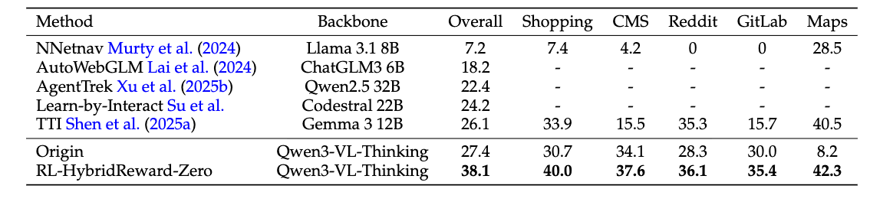
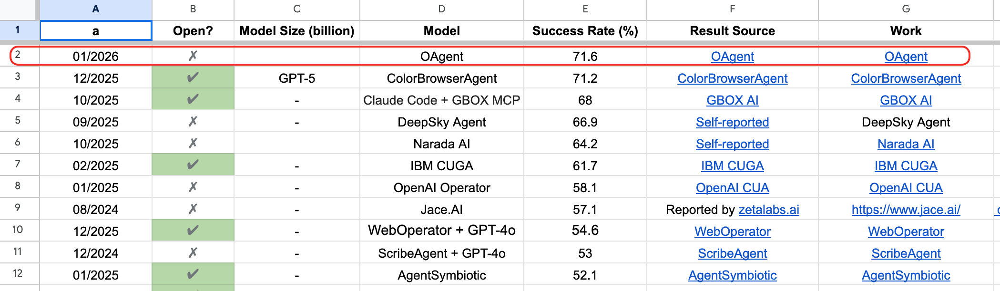

# OpAgent


<p align="center">
    <a href="https://huggingface.co/codefuse-ai/OpAgent-32B">
        
    </a>
    <a href="https://modelscope.cn/models/codefuse-ai/OpAgent-32B">
        
    </a>
    <a href="https://arxiv.org/pdf/2602.13559">
        
    </a>
    <a href="https://huggingface.co/spaces/exias/OpAgent">
        
    </a>
    <a href="https://modelscope.cn/studios/codefuse-ai/OpAgent-32B-Q4-Demo">
        
    </a>

</p>

`OpAgent` is a comprehensive project for autonomous web navigation and operation. It now includes three complementary parts: a full-featured **Agentic Framework** for state-of-the-art performance, a streamlined **Single-Model Mode** for easy deployment, and a newly released **Multi-Agent RL Training Framework** for agent training research and experimentation.

## Contents
- [News](#news)
- [Overview](#overview)
- [Performance Highlights](#performance-highlights)
- [Getting Started](#getting-started)
- [Detailed Introduction: The Agentic Framework](#detailed-introduction-the-agentic-framework)
  - [Framework Architecture](#1-framework)
  - [Key Modules](#2-key-modules)
  - [Prompt System](#3-prompt-system)
  - [Key Features](#4-key-features)
- [Multi-Agent RL Training Framework](#multi-agent-rl-training-framework)
- [Citation](#citation)

## News
🔥🔥🔥 **[2026/04/24]** We have open-sourced our **multi-agent RL training framework** under [`opagent_training/`](./opagent_training/), covering training code, environment preparation helpers, and analysis/evaluation utilities.
➡️ **[Go to the Multi-Agent RL Training Guide For Details](./opagent_training/README.md)** ⬅️

🔥🔥🔥 **[2026/03/17]** We have released the demo on [HuggingFace](https://huggingface.co/spaces/exias/OpAgent) and [ModelScope](https://modelscope.cn/studios/codefuse-ai/OpAgent-32B-Q4-Demo). We invite everyone to try it out and share your feedback!

🔥🔥🔥 **[2026/03/17]** We have released the INT4-quantized version of the OpAgent-32B model, enabling efficient deployment on consumer-grade hardware with 24GB of VRAM. 
➡️ **[Go to the Single-Model Mode Usage Guide For Details](./opagent_single_model/README.md)** ⬅️

📄📄📄 **[2026/02/14]** We have released our technical report. Please refer to [OpAgent Technical Report](https://arxiv.org/pdf/2602.13559) for details.

🔥🔥🔥 **[2026/01/22]** We are pleased to announce that Opagent achieves a remarkable 71.6% resolve rate on the [Webarena](https://webarena.dev/) leaderboard.

## Overview

This repository provides the code and models for `OpAgent`, an operator agent for web navigation. We now open-source three complementary parts of the project:

1.  **OpAgent: Single-Model Mode** (`opagent_single_model/` directory)
2.  **OpAgent: The Full Agentic Framework** (`opagent/` directory)
3.  **OpAgent: Multi-Agent RL Training Framework** (`opagent_training/` directory)

## Performance Highlights

#### 1. Single-Model Enhancement via Online RL
We employ an innovative **Online Agentic Reinforcement Learning (RL)** pipeline to significantly improve the capability of a single VLM.


#### 2. Agentic Framework SOTA Performance
Our full agentic framework, OpAgent, achieves a state-of-the-art (SOTA) **71.6%** resolve rate on the WebArena benchmark.


## Getting Started

Depending on which part you'd like to use, please follow the instructions below.

### 🚀 Mode 1: Single-Model Mode (`opagent_single_model/`)
➡️ **[Go to Single-Model Mode Usage Guide](./opagent_single_model/README.md)** ⬅️

### 🚀 Mode 2: Agentic Framework (`opagent/`)
[**(Learn more about the Agentic Framework's architecture below)↓**](#detailed-introduction-the-agentic-framework)

### 🚀 Mode 3: Multi-Agent RL Training Framework (`opagent_training/`)
This module contains our newly open-sourced **multi-agent RL training framework**.

➡️ **[Go to Multi-Agent RL Training Guide](./opagent_training/README.md)** ⬅️

## Detailed Introduction: The Agentic Framework

This section details the architecture of our high-performance, multi-agent framework.

### 1. Framework 

This Agent adopts a modular **Planner-Grounder-Reflector-Summary** architecture.

### 2. Key Modules

#### 2.1 `LocalWebAgent` Class
The main body of the Agent, responsible for maintaining task status, calling various model modules, and executing the main loop.

#### 2.2 `LocalModelCaller` Class
A unified model call interface encapsulating requests to different backend services.

#### 2.3 `BrowserActor` & Distributed Execution
Browser execution and distributed workflow support.

### 3. Prompt System

The framework defines four core Prompt templates guiding different Agent roles.

### 4. Key Features

- Robustness handling
- Multimodal support

## Multi-Agent RL Training Framework

This repository also includes a dedicated sub-project for **multi-agent RL training** under [`opagent_training/`](./opagent_training/).

For detailed setup and usage guidance, see [`opagent_training/README.md`](./opagent_training/README.md).

## Citation

If you use OpAgent in your research or project, please cite it as follows:

```bibtex
@article{guo2026opagent,
  title={OpAgent: Operator Agent for Web Navigation},
  author={Guo, Yuyu and Yang, Wenjie and Yang, Siyuan and Liu, Ziyang and Chen, Cheng and Wei, Yuan and Hu, Yun and Huang, Yang and Hao, Guoliang and Yuan, Dongsheng and others},
  journal={arXiv preprint arXiv:2602.13559},
  year={2026}
}
```
